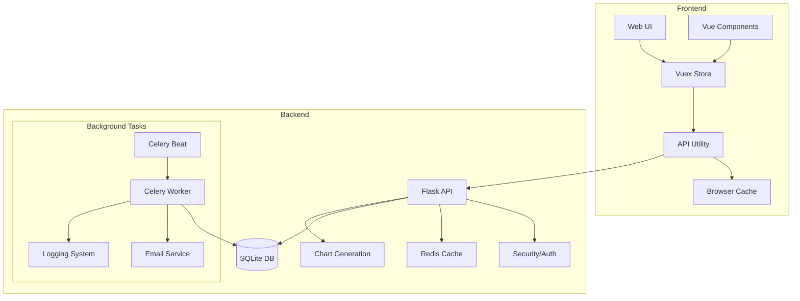

# Quiz Master Architecture Analysis

## System Overview

The Quiz Master is a modern web-based quiz management system built with Flask and Vue.js, featuring automated scheduling, interactive analytics, offline capabilities, and comprehensive performance tracking.

## Core Components



### 1. Frontend Architecture

#### Components
- **Core Components**
  - Question: Reusable question display/edit
  - Navbar: Navigation with search
  - Charts: Interactive data visualization

#### Pages
- **Admin Interface**
  - HomeAdmin: Subject/Chapter management
  - QuizAdmin: Quiz creation and management
  - SummaryAdmin: Interactive analytics

- **User Interface**
  - HomeUser: Quiz taking with offline support
  - ScoreUser: Performance tracking
  - SummaryUser: Personal analytics

#### State Management
- Vuex store for centralized state
- Persistent storage for offline functionality
- Consistent API error handling

### 2. Backend Architecture

#### Data Layer
- SQLite database with optimized models:
  - User/Role system (Flask-Security)
  - Subject > Chapter > Quiz > Question hierarchy
  - Score tracking with analytics
  - Attempt history with timestamps
- Redis cache with intelligent invalidation
- Chart generation with matplotlib/seaborn

#### API Layer
- RESTful API using Flask-RESTful
- Token-based authentication with CSRF protection
- Rate limiting and input validation
- Cached responses with proper invalidation
- Endpoints:
  ```
  /api/subjects    - Subject management
  /api/chapters    - Chapter operations
  /api/quizzes     - Quiz CRUD
  /api/questions   - Question management
  /api/scores      - Score tracking
  /api/charts      - Analytics
  /api/export      - Data export
  ```

#### Background Processing
- Celery workers for async tasks
- Improved logging and monitoring
- Scheduled jobs:
  - Daily reminders (6 PM IST)
  - Monthly reports with analytics
  - Quiz report generation
  - Chart updates

#### Security
- CSRF protection
- Rate limiting
- Input validation
- Secure token handling
- Role-based access control
- Data sanitization

### 3. Services

- **Redis**: Cache and message broker
- **MailHog**: Email testing (SMTP:1025, UI:8025)
- **Flask**: Web server (port 5000)
- **Celery**: Background tasks
- **Logger**: Centralized logging

## Current Features

### 1. Quiz System
- Interactive quiz taking
- Offline support
- Auto-save functionality
- Progress tracking
- Timer system
- Multiple attempt handling

### 2. Analytics
- Interactive charts
- Performance tracking
- Subject-wise analysis
- Progress visualization
- Export capabilities

### 3. User Experience
- Responsive design
- Keyboard navigation
- Accessibility support
- Search functionality
- Dark/Light themes
- Error handling

## Future Improvements

### Phase 1: Enhanced Quiz Features (2 weeks)
1. Multiple question types
2. Question categories
3. Dynamic difficulty
4. Better timer options
5. Rich text support

### Phase 2: Analytics Enhancement (2 weeks)
1. Advanced analytics
2. Custom reports
3. Performance predictions
4. Learning path suggestions
5. Export options

### Phase 3: Infrastructure (2 weeks)
1. Database migration to PostgreSQL
2. Redis cluster setup
3. Improved caching
4. Load balancing
5. Monitoring system

### Phase 4: User Experience (2 weeks)
1. Mobile app
2. Offline first approach
3. Push notifications
4. Social features
5. Gamification

## Development Guidelines

### 1. Code Organization
- Consistent file structure
- Component reusability
- Type hints
- Documentation
- Testing coverage

### 2. API Standards
- RESTful principles
- Consistent error handling
- Rate limiting
- Validation
- Documentation

### 3. Security Practices
- Input validation
- CSRF protection
- XSS prevention
- Rate limiting
- Secure headers

### 4. Testing Strategy
- Unit tests
- Integration tests
- End-to-end tests
- Performance testing
- Security testing

## Deployment

### 1. Environment Setup
- Environment variables
- Service configuration
- Logging setup
- Monitoring tools
- Backup strategy

### 2. CI/CD Pipeline
- Automated testing
- Code quality checks
- Security scanning
- Deployment automation
- Rollback procedures

### 3. Monitoring
- Error tracking
- Performance monitoring
- User analytics
- System health checks
- Alert system

## Maintenance

### 1. Regular Tasks
- Database backups
- Log rotation
- Cache cleanup
- Security updates
- Performance optimization

### 2. Emergency Procedures
- System recovery
- Data restoration
- Incident response
- User communication
- Post-mortem analysis