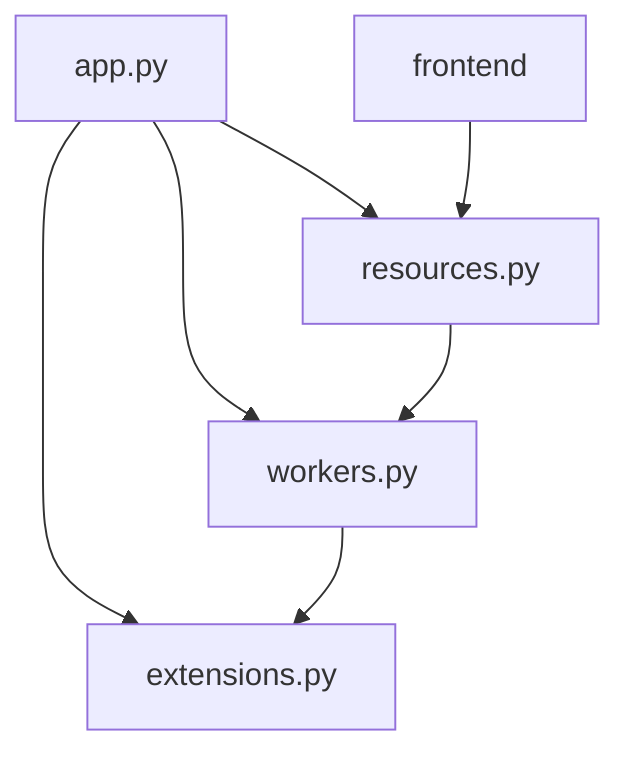

# Celery Integration Conflict Analysis

## Current Dependencies



## Potential Conflicts

1. Task Invocation
- ExportResource directly imports and uses `generate_user_export.delay()`
- Changing to @shared_task could break this integration
- Task IDs are used in frontend for status tracking

2. Flask Context
- Current tasks use app context within task definitions
- Example's approach wraps context around task execution
- Could affect database and cache operations

3. Configuration Location
- Current: Task scheduling in workers.py
- Proposed: Move to app.py
- Could affect service startup and task discovery

## Why Changes Might Be Risky

1. Working Integration
- Current implementation is functional
- Tasks execute properly
- Email notifications work
- Caching is effective

2. Frontend Dependencies
- Frontend expects specific task response formats
- Task status checking is based on current implementation
- UI handles task states appropriately

3. Service Management
- Current scripts work with existing structure
- Celery worker finds tasks correctly
- Beat scheduler works as expected

## Recommendation

Instead of full restructure, make minimal improvements:

1. Keep Current Structure
- Maintain workers.py as task definition module
- Keep task scheduling configuration there
- Preserve existing task decorators

2. Add Context Improvements
```python
# In workers.py - Add context wrapper
def ensure_context(fn):
    def wrapper(*args, **kwargs):
        from flask import current_app
        if current_app:
            return fn(*args, **kwargs)
        else:
            with app.app_context():
                return fn(*args, **kwargs)
    return wrapper

# Apply to tasks
@celery.task
@ensure_context
def send_daily_reminders():
    # existing implementation
```

3. Update Configuration
- Keep Redis and Celery config in respective files
- Add any missing optimizations
- Maintain backward compatibility

## Benefits of Minimal Approach

1. Risk Reduction
- No disruption to existing functionality
- Frontend continues working
- Services remain stable

2. Maintains Clarity
- Clear separation of concerns
- Tasks stay in workers.py
- Configuration remains organized

3. Easy Rollback
- Changes are isolated
- Can revert individual updates
- No structural changes

## Implementation Steps

1. Add Context Wrapper
- Create ensure_context decorator
- Apply to existing tasks
- Test context availability

2. Optimize Configuration
- Review celery settings
- Add missing optimizations
- Keep location unchanged

3. Enhance Error Handling
- Add more detailed logging
- Improve error messages
- Maintain existing patterns

## Testing Focus

1. Task Execution
- Verify tasks still work
- Check context availability
- Validate email sending

2. Frontend Integration
- Confirm task status checking
- Verify export functionality
- Test UI responses

3. Service Operation
- Check worker startup
- Verify task scheduling
- Monitor task completion

This approach preserves working functionality while adding improvements from the example implementation where they make sense without risking existing integrations.