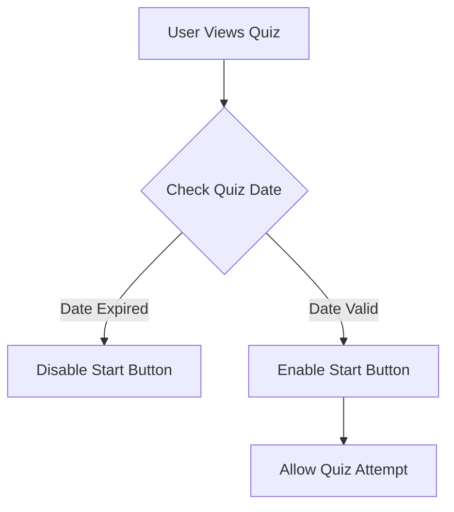
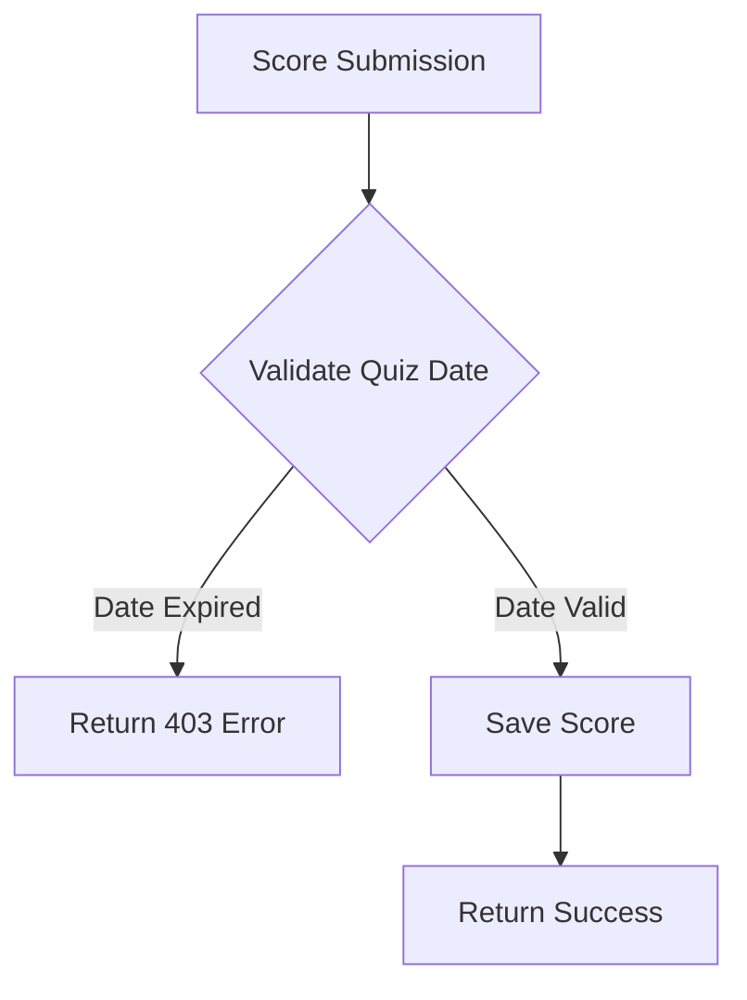

# Quiz Expiry Implementation Plan

## Overview
Implement quiz expiry functionality where users cannot attempt quizzes after their due date has passed.

## Technical Design

### Frontend Flow


### Backend Flow


## Implementation Details

### 1. Frontend Updates (HomeUser.js)

- Add computed property for quiz expiry check:
```javascript
isQuizExpired(quiz) {
    const quizDate = new Date(quiz.date_of_quiz);
    return quizDate < new Date();
}
```

- Update quiz list UI:
  - Disable "Start" button for expired quizzes
  - Add visual indicator for expired quizzes (e.g., grayed out row)
  - Add error handling for backend rejection

### 2. Backend Updates (resources.py)

- Add date validation in ScoreResource:
```python
def validate_quiz_date(quiz_id):
    quiz = Quiz.query.get(quiz_id)
    if quiz.date_of_quiz < datetime.now():
        return False
    return True
```

- Implement validation in score submission:
  - Check quiz expiry before saving score
  - Return 403 status with clear error message if expired
  - Add proper logging for rejected attempts

### 3. Error Handling

Frontend:
- Display user-friendly messages for expired quizzes
- Handle backend rejection gracefully
- Prevent UI manipulation attempts

Backend:
- Return descriptive error messages
- Log attempted submissions of expired quizzes
- Maintain proper audit trail

## Testing Plan

### Test Cases

1. UI Validation
   - Verify expired quizzes are visually distinct
   - Confirm Start button is disabled for expired quizzes
   - Test date comparison edge cases

2. Backend Validation
   - Verify score submission rejection for expired quizzes
   - Test date validation accuracy
   - Check error message clarity

3. Edge Cases
   - Quiz expiring during attempt
   - Different timezone scenarios
   - Date format handling

### User Experience Testing

- Clear visual indicators
- Informative error messages
- Smooth error handling
- Consistent behavior across browsers

## Implementation Steps

1. Frontend Implementation
   - Add quiz expiry computed property
   - Update quiz list template
   - Implement error handling
   - Add visual styling

2. Backend Implementation
   - Add date validation logic
   - Update score submission endpoint
   - Implement logging
   - Add error handlers

3. Testing
   - Write and run test cases
   - Perform user experience testing
   - Test edge cases
   - Cross-browser testing